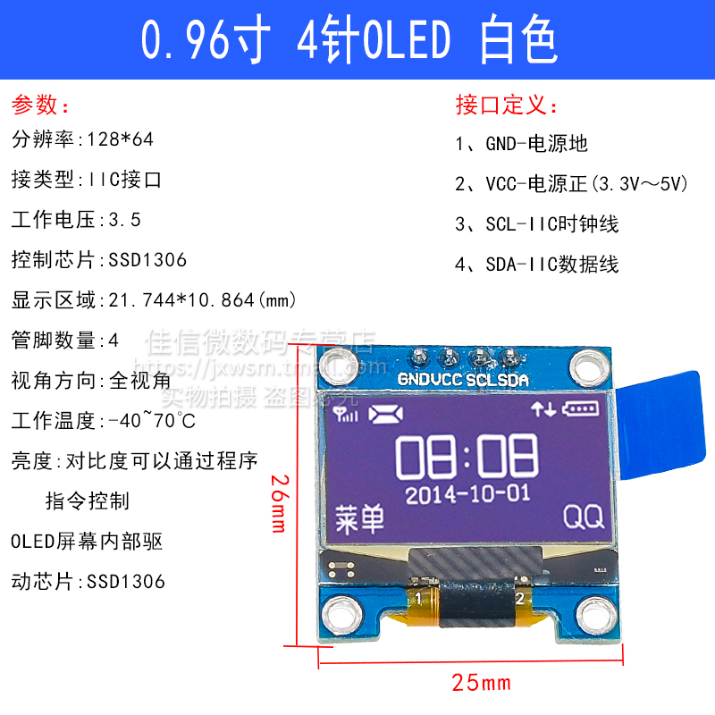
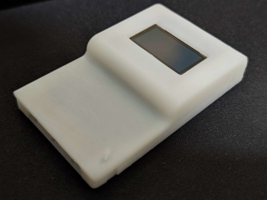

# sd2psx: PCB

<table>
<tr>
    <td></td>
    <td></td>
    <td></td>
</tr>
</table>

## Production notes

The PCB must be produced in 0.8mm thickness. Production files are provided under the "Releases" tab. These do not include the through-hole OLED module.

## PSRAM notes (LY68L6400SLIT)

As of June 2023, the LY68L6400SLIT is no longer available from JLCPCB. I've also seen multiple reports of people receiving a **fake chip** when purchasing one from aliexpress. The following chips are a drop-in replacement for the PSRAM:

* IPUS IPS6404LSQ
* ESP PSRAM64H
* AP 6404L-3SQR - Available from [Mouser](https://www.mouser.com/ProductDetail/AP-Memory/APS6404L-3SQR-SN?qs=IS%252B4QmGtzzqsn3S5xo%2FEEg%3D%3D)
* Lyontek LY68L6400S

I recommend switching to the AP 6404L-3SQR module; it can be assembled by JLCPCB by fist ordering it into your [personal parts library](https://jlcpcb.com/user-center/smtPrivateLibrary/?index=1).

## OLED module notes

The case requires a slim OLED module. The more common full-sized module will not fit into the case:

Examples of compatible modules:
- https://detail.tmall.com/item.htm?id=534583545403&skuId=3942158349315
- https://www.aliexpress.com/item/32638662748.html (make sure to select the smaller module marked as "New-White")

Spec sheet of a compatible module:

**Make sure that the pinout goes GND/VCC/SCL/SDA**. There are modules that swap GND/VCC around, these won't work.

## Assembly tips

When attaching the module to the PCB, remove protective OLED screen film (to prevent misalignment), then drop the module into the case so that the screen ends up flush against the case wall. Solder it on in that setup, then clip the pins:

There may be extra space between the pin header and the PCB, depending on your 3d print tolerances, but when fully assembled it should look nice and flush.
